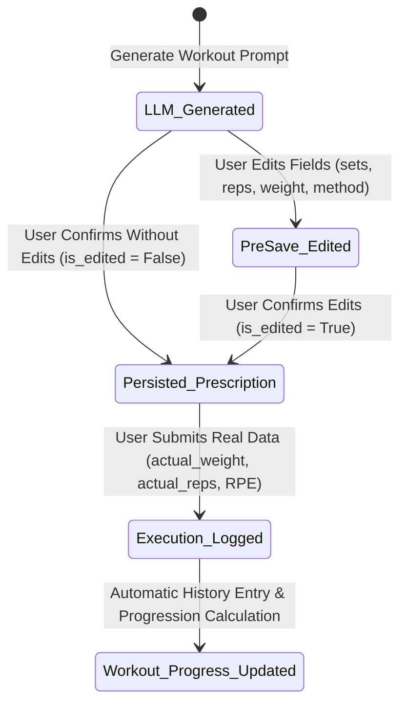

# Data Model: Workout Execution & Editing Layer

**Feature**: Workout Execution & Editing Layer (`001-workout-execution-editing`)  
**Date**: 2026-07-24  

## Entities & Schemas

### 1. Exercise (Database Model Update: `exercises` table)

| Column | Type | Constraints / Attributes | Description |
| :--- | :--- | :--- | :--- |
| `id` | Integer | Primary Key, Indexed | Unique identifier for exercise item |
| `workout_id` | Integer | Foreign Key (`workouts.id`) | Belongs to workout session |
| `name` | String | Required | Exercise name (e.g. "Supino Reto com Barra") |
| `nickname` | String | Nullable | Optional alias |
| `equipment` | String | Nullable | Equipment required (e.g. "Barra", "Halteres") |
| `accessory` | String | Nullable | Accessories required |
| `method` | String | Nullable | Method from controlled glossary |
| `sets` | Integer | Required, > 0 | Target number of sets |
| `reps` | Integer | Required, > 0 | Target reps per set |
| `weight_kg` | Float | Required, >= 0.0 | Prescribed / edited weight target |
| **`actual_weight_kg`** | Float | Nullable, >= 0.0 | **[NEW]** Real weight executed |
| **`actual_reps`** | Integer | Nullable, >= 0 | **[NEW]** Real reps completed |
| **`actual_rpe`** | Float | Nullable, 1.0 <= val <= 10.0 | **[NEW]** Perceived effort (1-10) |
| **`is_edited`** | Boolean | Default = False | **[NEW]** True if modified pre-save |

---

### 2. WorkoutProgress (New Database Model: `workout_progress` table)

| Column | Type | Constraints / Attributes | Description |
| :--- | :--- | :--- | :--- |
| `id` | Integer | Primary Key, Indexed | Historical entry ID |
| `exercise_name` | String | Indexed, Required | Standardized exercise name |
| `date` | DateTime | Default = utcnow | Timestamp of execution |
| `actual_weight_kg` | Float | Required, >= 0.0 | Recorded weight |
| `actual_reps` | Integer | Required, >= 0 | Recorded reps |
| `actual_rpe` | Float | Required, 1.0 <= val <= 10.0 | Recorded RPE |
| `suggested_weight_kg` | Float | Required, >= 0.0 | Calculated next load recommendation |

---

### 3. Pydantic Schemas (`app/schemas.py` Updates)

#### `ExerciseBase` / `ExerciseCreate` / `ExerciseOut`
```python
class ExerciseUpdate(BaseModel):
    sets: Optional[int] = None
    reps: Optional[int] = None
    weight_kg: Optional[float] = None
    method: Optional[str] = None
    is_edited: Optional[bool] = True

class ExerciseExecutionUpdate(BaseModel):
    actual_weight_kg: float
    actual_reps: int
    actual_rpe: float  # Validation: 1.0 <= RPE <= 10.0

    @field_validator('actual_rpe')
    def validate_rpe(cls, v):
        if not (1.0 <= v <= 10.0):
            raise ValueError('RPE deve estar entre 1.0 e 10.0')
        return v

    @field_validator('actual_weight_kg', 'actual_reps')
    def validate_non_negative(cls, v):
        if v < 0:
            raise ValueError('Valores não podem ser negativos')
        return v
```

#### `ExerciseProgressionOut`
```python
class ExerciseProgressionOut(BaseModel):
    exercise_name: str
    last_weight_kg: Optional[float]
    last_reps: Optional[int]
    last_rpe: Optional[float]
    suggested_weight_kg: float
    progression_applied: float  # Delta in kg (e.g. +2.5, +5.0, 0.0)
    safety_cap_applied: bool  # True if 120% max cap was triggered
    notes: str
```

---

## State Transitions


